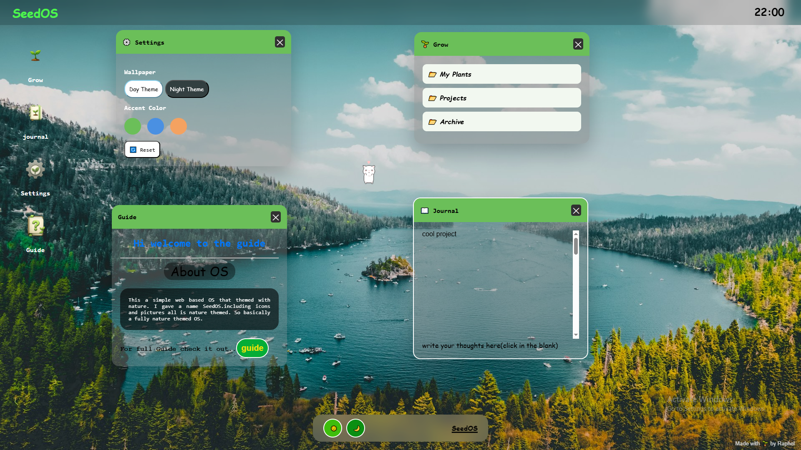
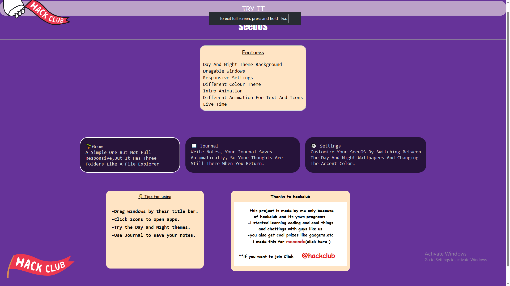

# Seedos

I created this project along side learning html,css,and javascript.This was my dream project when i was to start learning web dev.I see lot of projects like this and motivated to build my own one.I happy to finish this project as a  starter in web dev.

---

##  About

SeedOS is a web based OS with nature theme.I created this project to study web dev.This os is working in web browser.Like a original os like windows,mac,linux but limit with features and accessability.Maybe in future this type of webos will come with cloud can be used in browser like cloud gamming.Its a sure posibility.

---

# Features

- Startup Animation with loading bar
- Responsive text and icons
- Nature themed icons and background
- 4 apps-grow,journal,settings,guide
- grow-like the windows file explorer
- journal-like a notepad
- settings-most worked one with lot of features include day-night theme,changeble accent colours,reset btn
- guide-The simple guide about the seedos,In guide i created a specific web page including all the features
- Real time in the upper dock
- simple dock in the bottom with day-night btn
- Transparent windows
- At last a cute dragable dancing pet
- etc.......
---

##  Technologies Used(dev lang)

- HTML5
- CSS3
- Javascript

---

## Screenshots

---

##  Future Improvements

- Better UI
- More pets
- Sound effects
- More bacgrounds
- More features
- Smooth transitions

---

##  License

 MIT License- Do what ever you want with it,Dont blame me if your browser catches fire ,jk.
